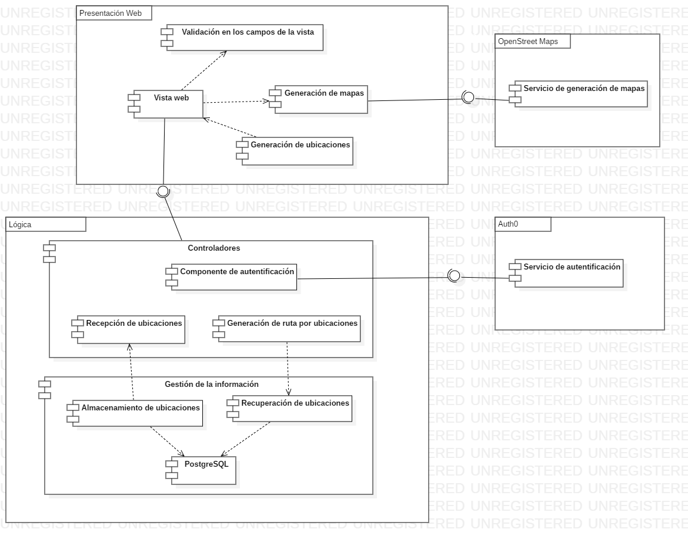
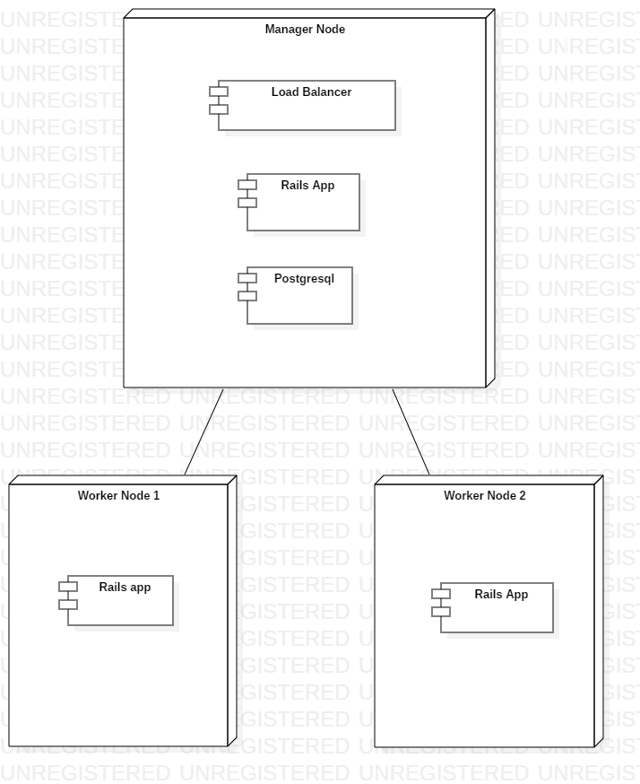

# Documento 3

## 1. Miembros del equipo

* Diego Antonio Fonseca
* Luis Miguel Marín
* Sebastián Patiño

## 2. Diseño de arquitectura de la Aplicación y Sistema

### a. Vista de desarrollo

#### i. Definición de Tecnología de Desarrollo

La tecnología utilizada para desarrollar la aplicación es Ruby on Rails, un framework que permite crear aplicaciones web con modelo vista controlador. Para la vista de la aplicación se utilizó HTML 5, JavaScript y Bootstrap.

#### ii. URLs de repositorio (github)

https://github.com/dfonseca97/Proyecto2

### b. Vista de despliegue

#### i. Definición de Tecnología v3 – Infraestructura TI

La aplicación fue desplegada en AWS y el DCA utilizando una máquina virtual con un sistema operativo Centos7. Se utilizaron contenedores Docker para subir el servidor web NGINX y la aplicación en rails. Para asegurar disponibilidad y rendimiento se distribuyó la aplicación mediante Docker Swarm en los diferentes nodos que se poseen y además se configuró el servidor web para funcionar como un balanceador de cargas. La base de datos utilizada fue PostgreSQL y se encuentra ubicada en el nodo manager para poder sincronizar los datos de la aplicación. 

#### ii. URL de ejecución privada
http://10.131.137.153

#### iii. URL de ejecución pública y segura: telematica2.tk

## 3. Implementación y Pruebas por Atributo de Calidad

### a. Implementación

Para la disponibilidad se decidió desplegar la aplicación en diferentes nodos con contenedores conectados por Docker Swarm con el objetivo de lograr que la aplicación no falle si el nodo en la que está se cae. Para el rendimiento se implementó un balanceo de cargas mediante una configuración de NGINX con un método de Round Robin para lograr distribuir las peticiones a los diferentes nodos, utilizando sticky session para mantener las sesiones que ya han sido iniciadas. Para la seguridad se implementó la autentificación con Auth0 lo que permite iniciar sesión en un servidor externo a la aplicación y evitar falsificación de peticiones en la aplicación. También se creó un certificado SSL para el dominio de la aplicación. 

#### i. Herramientas utilizadas

Las herramientas utilizadas para la implementación fueron el framework de Ruby on Rails, Auth0 para la autentificación, OpenStreet Maps para la visualización de las ubicaciones.

#### ii. Cambios en la implementación de la aplicación

Para la realización de este proyecto se modificó la autentificación, antes se utilizaba devise. La visualización se cambió de Google Maps a OpenStreet Maps

### b. Esquemas de pruebas para comprobar el Atributo de Calidad.

* **Disponibilidad:** Las pruebas de disponibilidad serán realizadas enfocándose en la independencia de los nodos entre sí. Se planea desconectar un nodo y verificar que los demás sigan funcionando. 

* **Rendimiento:** Las pruebas de rendimiento serán realizadas con la herramienta JMeter la cual permite hacer gran cantidad de peticiones a la aplicación. Utilizando esta herramienta se puede verificar el tiempo de respuesta de la aplicación. Se espera lograr obtener un tiempo de respuesta promedio de 1 segundo en la generación de las ubicaciones. 

* **Seguridad:** Las pruebas de seguridad serán realizadas enfocándose en la fortaleza de las políticas de contraseña, protección contra inyección de SQL en los campos de la aplicación y ataques de falsificación de peticiones en sitios cruzados. Para comprobar la seguridad de la aplicación se realizarán una serie de scripts simulando este tipo de ataques y se espera que la aplicación sea resistente contra ellos. 

## 4. Marco-referencia-v3: Versión final de las bases conceptuales, patrones, mejores prácticas, etc de los atributos de calidad seleccionados.

### Disponibilidad (Confiabilidad y Recuperación)
En general, el principal objetivo del QA de disponibilidad se resume a Permitir soportar las fallas del sistema de tal manera que el servicio entregado por dicho sistema siga siendo compatible con su especificación.
Esto implica entender que una falla solo representa una amenaza cuando este fenómeno  afecta tanto a los servicios del sistema, que las especificaciones del sistema ya no se cumplen.
La literatura propone estrategias y tácticas que garantizan la disponibilidad desde los siguientes tres frentes:

 * **Detección de fallas**
Para la detección de fallas existen varias tácticas, entre ellas se encuentran las estrategias de _Ping_ o _Echo_ (para verificar que un sistema responda), monitores tipo _heatbeat_ o _watchdog_ (para verificar que un sistema sigue ”con vida” de no ser así, lo reinicia), _Sistemas de excepciones_, y sistemas de _Redundancia Modular Triple_.

* **Recuperación de fallas**
En relación a la recuepración de fallas existen 2 grandes procesos:
  * **Reparation and repair**: En esta fase la idea es que el sistema reconozca la falla y la repare, pero que mientras eso ocurre desde la perspectiva del usuario el sistema debe seguir funcionando de manera correcta, para esto tecnologías como _redundancia pasiva_ y _redundancia activa_, _sparing_, _gestión de excepciones_ e incluso _actualizaciones de software_; permiten administrar este proceso.
  
  * **Reintroduction**: En esta frase el objetivo es dejar las funcionalidades del sistema corriendo en estado normal, cumpliendo con las especificaciones iniciales, esta reintroducción se habilita despues de la fase de reparación y las tecnologías que se usan para esto son _Sombra_, _resincronización de estado_, _Rollback_, _Reinicio escalado_, entre otras.

* **Prevención de fallas**
Una de las mejores prácticas a la hora de garantizar disponibilidad y enfrentarse a las fallas, es preveer su aparición y/o realizar actividades preventivas que minimicen el impacto de las fallas, a este nivel las tecnologías que podemos usar son _Retiro del servicio_, _Gestión de Transacciones atómicas_, tener _Monitores de Procesos_ o _Prevención de Excepciones_.

 >[Ver más](https://www.semanticscholar.org/paper/Realizing-and-Refining-Architectural-Tactics-%3A-Scott/5840ae598740c6dbfb69dc3ce30f43efa23ef9b9)
 >[_Tácticas de arquitetura: Disponibilidad_](https://profesores.virtual.uniandes.edu.co/~isis2503/dokuwiki/lib/exe/fetch.php?media=principal:modulo10-disponibilidad.pdf)

### Rendimiento
El rendimiento puede ser definido como la efectividad total de un sistema. Puede ser medido de diferentes maneras pero las más comunes incluyen el throughput, definido como cuántas unidades de información puede procesar el sistema en un determinado tiempo, y el tiempo de respuesta. El rendimiento depende de muchas variables desde cómo está codificado el sistema hasta la infraestructura que lo soporta. 
Por lo general es un atributo muy importante y debe ser considerado desde las fases iniciales de diseño de una solución. 
Existen varias maneras de lograr un buen rendimiento:

* Entrega y carga optimizada de los assets estáticos
* Seleccionar un framework adecuado.
* Monitoreo del sistema
* Considerar el rendimiento desde tempranas etapas del diseño de la solución.
* Peticiones on-demand y asíncronas
* Desarrollo y pruebas iterativas

Implementar pruebas de rendimiento también es un aspecto muy importante en un sistema, se deben considerar pruebas de la carga del sistema y de la infraestructura. 

### Seguridad

La seguridad es responsable de la capacidad que tiene un sistema para reducir la posibilidad de acciones maliciosas o accidentales al igual que la posibilidad de pérdida o robo de información, a la ves que se provee un servicio fiable a los usuarios legítimos. Hay varias medidas que pueden ser usadas para proteger un sistema, como: autenticación, cifrado, auditoría, entre otros.

Una buena estrategia de seguridad involucra los siguientes escenarios:
* Análisis de seguridad
* Identificación de amenazas
* Diseño de seguridad
* Implementación de seguridad
* Pruebas de seguridad
* Monitoreo de seguridad

Tomando en cuenta estos escenarios, se deben de tener encuenta los siguientes principios de seguridad al momento de pasar por cada una de esas fases:

* Defensa en profundidad
* Asegurar el eslabón más débil
* El principio de mínimo privilegio
* Compartimentación
* Un solo punto de acceso
* Administración de seguridad
* Soporte para extensibilidad
* Validación de la información de usuario
* Minimización de la superficie vulnerable
* Plan para fallos
